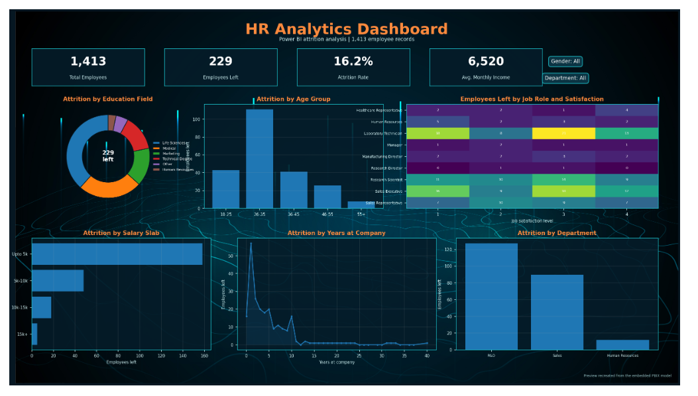

# HR Analytics Dashboard



> Preview shown above is the original report screenshot from the completed Power BI dashboard. A recreated model-based preview is also preserved at `assets/dashboard-preview-recreated.png`.

An interactive Power BI project for analyzing employee attrition across departments, age groups, education fields, salary bands, job roles and years of service.

## Project overview

The report analyzes **1,413 employee records** and presents management-ready KPIs, filters and attrition breakdowns. It demonstrates data transformation in Power Query, DAX measure design, data-quality checks and interactive dashboard development.

## Dashboard KPIs

| Metric | Result |
|---|---:|
| Total employees | 1,413 |
| Employees left | 229 |
| Attrition rate | 16.2% |
| Average monthly income | 6,519.53 |

## Business questions

- What is the overall employee attrition rate?
- Which departments, age groups and salary bands contribute the most departures?
- How does attrition vary by education field, job role and job satisfaction?
- At what stages of employee tenure are departures most common?
- Which employee segments may require closer retention analysis?

## Report components

- KPI cards for total employees, employees left, attrition rate and average monthly income
- Gender and department slicers
- Attrition by education field
- Attrition by age group
- Job-role and satisfaction matrix
- Attrition by salary slab
- Attrition by years at company
- Attrition by department

## Tools and techniques

- **Power BI Desktop** for report development
- **Power Query** for CSV ingestion, header promotion, type conversion, column-name standardization and duplicate removal
- **DAX** for KPI measures
- **Data profiling and validation** for record-level quality checks
- **Interactive filtering** through slicers and cross-filtering visuals

## DAX measures

The model includes four measures:

- `Total Employees`
- `Employees Left`
- `Average Monthly Income`
- `Attrition Rate`

Exact expressions are documented in [`docs/dax_measures.md`](docs/dax_measures.md).

## Selected findings

- Overall attrition was **16.2%**.
- The **18-25** age group recorded the highest age-group attrition rate at **36.8%**.
- Employees working overtime recorded **30.9%** attrition.
- The **Upto 5k** salary band recorded **22.0%** attrition.
- Sales recorded the highest department attrition rate at **20.8%**.

See [`docs/key_findings.md`](docs/key_findings.md) for supporting detail.

## Repository structure

```text
hr-analytics-power-bi-dashboard/
|-- assets/
|   |-- dashboard-preview.png
|   `-- dashboard-background.jpg
|-- dashboard/
|   `-- HR_Analytics_Dashboard.pbix
|-- data/
|   `-- README.md
|-- docs/
|   |-- data_dictionary.csv
|   |-- dax_measures.md
|   |-- key_findings.md
|   |-- publication_checklist.md
|   `-- report_inventory.csv
|-- outputs/
|   `-- aggregated CSV summaries
|-- scripts/
|   `-- export_model_summaries.py
|-- .gitignore
|-- README.md
`-- requirements.txt
```

## Open the dashboard

1. Download `dashboard/HR_Analytics_Dashboard.pbix`.
2. Open it in Power BI Desktop.
3. The saved embedded model should display immediately.
4. To refresh the report, update the CSV path under **Transform data > Data source settings**.

## Reproduce the aggregate exports

```bash
pip install -r requirements.txt
python scripts/export_model_summaries.py
```

## Data and publishing note

Employee-level data is not separately distributed in this repository package. Before publishing, review [`docs/publication_checklist.md`](docs/publication_checklist.md), especially the existing Power Query row-removal step and local file path.

## Author

**Ijash Ahmed Z**  
[LinkedIn](https://www.linkedin.com/in/ijash-ahmed-z/) | [GitHub](https://github.com/ijash-ahmed-z) | [Portfolio](https://ijash-ahmed-z.netlify.app/)
